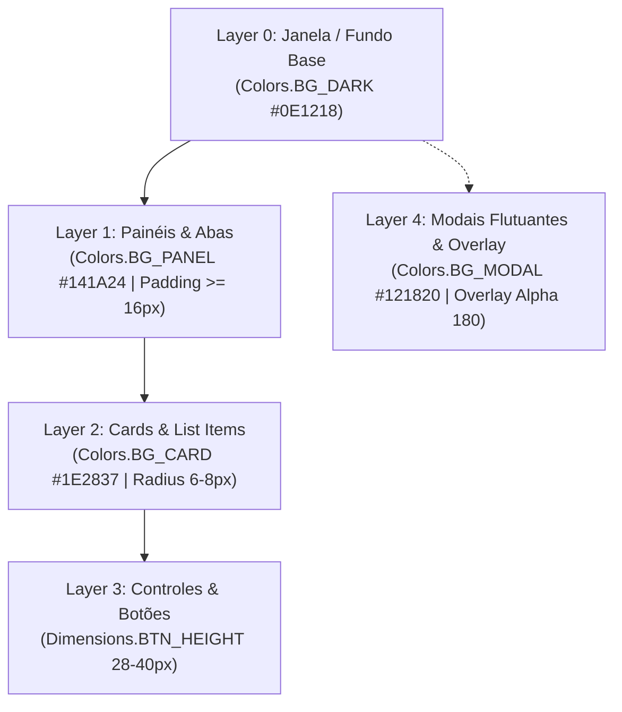
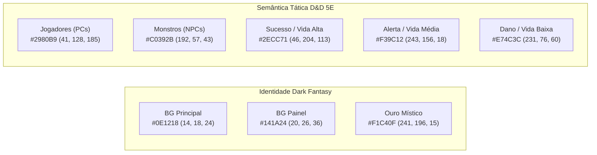

# 🎨 Design System & Diretrizes de UI — Medusa VTT

Este documento estabelece as normas canônicas de interface de usuário (UI), experiência do usuário (UX), design tokens, hierarquia visual e padrões de renderização gráfica para as janelas [`DMWindow`](file:///c:/Users/aguia/OneDrive/Documentos/Medusa/medusa_controler/src/ui/dm_window.py), [`PlayerWindow`](file:///c:/Users/aguia/OneDrive/Documentos/Medusa/medusa_controler/src/ui/player_window.py), HUDs e modais do **Medusa VTT**.

Todas as implementações de interface DEVEM aderir estritamente às constantes centralizadas no módulo [`src/ui/utils/ui_constants.py`](file:///c:/Users/aguia/OneDrive/Documentos/Medusa/medusa_controler/src/ui/utils/ui_constants.py) e às premissas arquiteturais em [`PREMISES.md`](file:///c:/Users/aguia/OneDrive/Documentos/Medusa/medusa_controler/PREMISES.md).

---

## 1. Grid de Espaçamento e Escala de 8pt (8-Point Grid)

Para assegurar alinhamento visual harmônico, ritmo consistente e proporcionalidade entre diferentes resoluções, o Medusa adota a convenção da **escala de 8 pontos (8-Point Grid)** com subdivisão de **4 pontos (Half-Step)**.

> [!IMPORTANT]
> É proibido o uso de valores "mágicos" arbitrários (como `padding=7`, `gap=13`, `margin=19`). Todos os offsets, espaçamentos internos (*padding*), margens (*margin*) e distâncias entre controles (*gap*) DEVEM ser múltiplos de 4 ou 8 pixels derivados da classe [`Spacing`](file:///c:/Users/aguia/OneDrive/Documentos/Medusa/medusa_controler/src/ui/utils/ui_constants.py).

### 1.1. Tabela Canônica de Tokens de Espaçamento

| Constante | Valor | Alias Semântico | Caso de Uso Canônico |
| :--- | :--- | :--- | :--- |
| `Spacing.TINY` | `4px` | `GAP_TINY` | Micro-espaçamento entre ícones pequenos e labels, padding interno de badges, offsets finos de sombra. |
| `Spacing.SM` | `8px` | `GAP_SMALL` | Margem interna de botões compactos, gap entre botões adjacentes em linha, espaçamento entre campos de formulário. |
| `Spacing.MD` | `16px` | `GAP_MEDIUM` / `CONTAINER_PADDING` | **Padding interno padrão** de contêineres, painéis laterais, modais e isolamento de grupos destrutivos. |
| `Spacing.LG` | `24px` | `GAP_LARGE` | Margens externas entre blocos de conteúdo e divisões verticais de grupos de combate. |
| `Spacing.XL` | `32px` | `GAP_XLARGE` | Separadores de seções principais, altura de cabeçalhos globais e margens de borda de tela. |

### 1.2. Aplicação em Código (Arcade XYWH)

```python
from src.ui.utils.ui_constants import Spacing

# Exemplo de padding e posicionamento baseado na escala de 8pt
panel_x = Spacing.MD
panel_y = Spacing.MD
panel_w = width - (Spacing.MD * 2)
panel_h = height - (Spacing.MD * 2)

# Gap entre itens de uma lista vertical
item_y = top_y - index * (item_height + Spacing.SM)
```

---

## 2. Hierarquia de Contêineres e Painéis ("Divs" do VTT)

Como o framework **Python Arcade** opera renderizando primitivas gráficas diretamente via GPU (sem um DOM nativo de navegadores), a estruturação de painéis, cards e modais segue o padrão de contêineres lógicos (*Box Model* virtual).



### 2.1. Regras Canônicas de Contêineres

1. **Padding Interno Obrigatório em Painéis de Fundo (`background_panels`):**
   - Todo painel de fundo DEVE ter um *padding* interno mínimo de **16px** (`Spacing.MD`).
   - Textos, botões, inputs e ícones **NUNCA** devem encostar nas bordas dos painéis ou da janela.
2. **Cantos Arredondados (*Corner Radii*):**
   - Cards e painéis flutuantes: **6px a 8px** (`Dimensions.CORNER_RADIUS_DEFAULT` / `Dimensions.CORNER_RADIUS_CARD`).
   - Janelas modais de confirmação: **10px** (`Dimensions.CORNER_RADIUS_MODAL`).
   - Micro-tags e badges: **4px** (`Dimensions.CORNER_RADIUS_SM`).
3. **Bordas e Divisores:**
   - Espessura canônica: **1px** (`Dimensions.BORDER_WIDTH_DEFAULT`) para divisores e contornos de repouso; **1.5px** a **2px** (`Dimensions.BORDER_WIDTH_ACTIVE` / `Dimensions.BORDER_WIDTH_THICK`) para estados ativos, seleções ou campos com foco.
   - Contraste Moderado: utilizar cores com canal alfa controlado (`Colors.BORDER_DEFAULT` = `(50, 65, 90, 200)` e `Colors.BORDER_SUBTLE` = `(40, 50, 65, 120)`).
4. **Modais e Diálogos de Confirmação:**
   - Devem sempre renderizar um overlay escurecido de tela cheia (`Colors.BG_OVERLAY` = `(0, 0, 0, 180)`) para isolar visualmente o foco de atenção do Mestre.
   - Largura mínima recomendada de **360px** (`Dimensions.MODAL_MIN_WIDTH`) com padding interno de **16px** (`Dimensions.MODAL_PADDING`).

---

## 3. Anatomia de Botões e Controles Interativos

Os botões e controles interativos do Medusa VTT devem oferecer affordance clara, feedback tátil visual imediato e prevenção contra cliques acidentais (*Poka-Yoke*).

```mermaid
stateDiagram-v2
    [*] --> DEFAULT
    DEFAULT --> HOVER: mouse_over == True (+15% Brilho)
    HOVER --> ACTIVE: mouse_down == True (-10% Escurecimento)
    ACTIVE --> DEFAULT: mouse_release
    DEFAULT --> DISABLED: is_enabled == False (40% Alpha)
    DISABLED --> DEFAULT: is_enabled == True
```

### 3.1. Dimensões e Alturas Mínimas

- **Botões Padrão de Ação Primária / Secundária:**
  - Altura: **36px a 40px** (`Dimensions.BTN_HEIGHT_DEFAULT` a `Dimensions.BTN_HEIGHT_LARGE`).
  - Padding horizontal mínimo: **12px** (`Dimensions.BTN_PADDING_X_MIN`).
- **Botões Compactos de Barra de Ferramentas / Cabeçalho:**
  - Altura / Largura: **28px** ou **32px** (`Dimensions.BTN_SIZE_COMPACT_SM` / `Dimensions.BTN_SIZE_COMPACT_MD`).
  - Utilizados para botões de controle de turno (`◀ Turno`, `▶ Turno`), incrementadores (`+`, `-`) e atalhos rápidos.
- **Campos de Texto Editáveis (`SmartTextInput`):**
  - Altura padrão de **36px** (`Dimensions.INPUT_HEIGHT_DEFAULT`) ou compacto de **28px** (`Dimensions.INPUT_HEIGHT_COMPACT`).

### 3.2. Espaçamento entre Botões e Isolamento Destrutivo

- **Botões em Linha (Ações Correlatas):** Gap horizontal de **8px** (`Dimensions.BTN_GAP_INLINE` / `Spacing.SM`).
- **Ações Destrutivas ou Irreversíveis (ex: "Deletar", "Resetar", "Encerrar Combate"):**
  - DEVEM ser isoladas por um gap mínimo de **16px** (`Dimensions.BTN_GAP_DESTRUCTIVE` / `Spacing.MD`) do bloco de ações positivas, ou posicionadas no canto oposto do painel.
  - Ações destrutivas requerem cor semântica carmim (`Colors.DANGER`) e modal de confirmação prévia quando irreversíveis.

### 3.3. Áreas de Clique (*Hitboxes*) e Acessibilidade

> [!CAUTION]
> **Proibição de Hitbox Seca:** Nunca renderizar texto ou ícone clicável baseado estritamente na bounding box do texto. Todo elemento clicável DEVE possuir uma caixa delimitadora (hitbox) retangular preenchida ou virtual com padding horizontal e vertical adequados.

A detecção canônica de clique para botões com âncora centralizada (`x, y` no centro):

```python
def is_point_inside_button(px: float, py: float, cx: float, cy: float, w: float, h: float) -> bool:
    """Verificação pixel-perfect de clique em botão centralizado."""
    return (cx - w / 2 <= px <= cx + w / 2) and (cy - h / 2 <= py <= cy + h / 2)
```

---

## 4. Padronização Tipográfica

A tipografia do Medusa VTT utiliza uma escala modular e proporcional, desenhada para máxima legibilidade contra fundos escuros e em telas de alta densidade de pixels.

### 4.1. Escala de Tamanhos de Fonte

| Token | Tamanho | Peso | Caso de Uso |
| :--- | :--- | :--- | :--- |
| `Typography.SIZE_TAB_TITLE_LG` | `20px` | Bold | Títulos destacados de modais principais e telas de carregamento. |
| `Typography.SIZE_TAB_TITLE` | `18px` | Bold | Títulos de abas principais na barra do Mestre (`DMHeader`). |
| `Typography.SIZE_HEADER` | `16px` | Bold | Cabeçalhos de seção (ex: "ROSTER DE COMBATE", "CRIAR ENCONTRO"). |
| `Typography.SIZE_SUBHEADER` | `14px` | Bold | Subtítulos de listas, nomes de cards e grupos táticos. |
| `Typography.SIZE_BODY` | `12px` | Regular / Bold | Corpo de texto principal, labels de inputs e descrições de monstros. |
| `Typography.SIZE_LABEL` | `11px` | Regular | Labels compactos de formulários, atributos (FOR, DES, CON) e contadores. |
| `Typography.SIZE_BADGE` | `10px` | Bold | Badges de status, tags de tipo (PC / NPC) e contadores de rodada. |
| `Typography.SIZE_MICRO` | `9px` | Bold / Regular | Atalhos de teclado, números de versão e notas de rodapé de mini-mapa. |

### 4.2. Pilha de Fontes (*Font Stack*)

O sistema emprega a tupla `Typography.FONT_FAMILY_UI`:
```python
FONT_FAMILY_UI = ("Consolas", "Calibri", "Segoe UI", "Arial")
```
- **Monospaçadas / Técnicas (`Consolas`):** Utilizadas para valores numéricos, métricas táticas e tabelas onde alinhamento de colunas é essencial.
- **Humanistas / Sem Serifa (`Calibri`, `Segoe UI`):** Utilizadas para títulos, botões e leitura fluida.

### 4.3. Linha de Base e Alinhamento Vertical

- Textos dentro de botões e inputs DEVEM ser desenhados com ancoragem centralizada:
  ```python
  arcade.Text(text="Confirmar", x=btn_x, y=btn_y, anchor_x="center", anchor_y="center", ...)
  ```
- Textos em listas e linhas tabulares devem utilizar `anchor_x="left"` e `anchor_y="center"` para alinhamento vertical estável.

---

## 5. Paleta de Cores e Estados de Interação

A identidade visual do Medusa é fundamentada no conceito **Dark Fantasy D&D 5E**, combinando tons sóbrios de azul-grafite profundo com acentos de ouro místico e cores de alto contraste funcional.



### 5.1. Cores de Identidade e Superfície

| Token | Hex | RGBA | Descrição de Uso |
| :--- | :--- | :--- | :--- |
| `Colors.BG_DARK` | `#0E1218` | `(14, 18, 24, 255)` | Fundo geral da aplicação e tela de descanso (IDLE). |
| `Colors.BG_PANEL` | `#141A24` | `(20, 26, 36, 255)` | Fundo da barra superior e dos painéis de controle do Mestre. |
| `Colors.BG_CARD` | `#1E2837` | `(30, 40, 55, 255)` | Cards de entidades na lista de iniciativa e biblioteca de monstros. |
| `Colors.BG_CARD_HOVER` | `#263246` | `(38, 50, 70, 255)` | Realce de hover para linhas e cards interativos. |
| `Colors.ACCENT_GOLD` | `#F1C40F` | `(241, 196, 15, 255)` | Dourado místico para títulos, foco e turnos em evidência. |
| `Colors.PC_BLUE` | `#2980B9` | `(41, 128, 185, 255)` | Identificador visual de Personagens Jogadores (PCs). |
| `Colors.NPC_RED` | `#C0392B` | `(192, 57, 43, 255)` | Identificador visual de Monstros e NPCs hostis. |

### 5.2. Cores de Feedback Semântico

- **Sucesso / Vida Cheia (`Colors.SUCCESS` = `(46, 204, 113, 255)`):** Confirmações, início de sessão, badges de HP seguro.
- **Alerta / Neutro (`Colors.WARNING` = `(243, 156, 18, 255)`):** Avisos, criaturas com HP entre 25% e 50%, pause de combate.
- **Perigo / Dano / Destrutivo (`Colors.DANGER` = `(231, 76, 60, 255)`):** Exclusões, criaturas caídas (0 HP), remoções e dano crítico.
- **Seleção Ativa / Turno (`Colors.INFO` = `(52, 152, 219, 255)`):** Combatente com turno ativo, ferramenta de pincel selecionada.

### 5.3. Convenção dos 4 Estados de Interação

1. **`DEFAULT`:** Cor base de repouso conforme o token especificado.
2. **`HOVER`:** Clareamento perceptivo de **10% a 15%** calculado via função pura `lighten(color, factor=0.15)`.
3. **`ACTIVE / PRESSED`:** Escurecimento perceptivo de **10%** via `darken(color, factor=0.10)`.
4. **`DISABLED`:** Atenuação de opacidade para **40% do canal alfa original** via `apply_disabled(color)` ou `with_alpha(color, int(color[3] * 0.40))`.

---

## 6. Módulo de Constantes (`src/ui/utils/ui_constants.py`)

Todo o design system está codificado como dataclasses e constantes puras em [`src/ui/utils/ui_constants.py`](file:///c:/Users/aguia/OneDrive/Documentos/Medusa/medusa_controler/src/ui/utils/ui_constants.py), sem execução de lógica procedural nem chamadas a `print()`.

### 6.1. Exemplo de Implementação de Botão Canônico com Tokens

```python
import arcade
from src.ui.utils.ui_constants import Spacing, Dimensions, Typography, Colors, lighten, darken, apply_disabled

class CanonicalButton:
    def __init__(self, label: str, cx: float, cy: float, is_danger: bool = False) -> None:
        self.label = label
        self.cx = cx
        self.cy = cy
        self.w = 120.0
        self.h = Dimensions.BTN_HEIGHT_DEFAULT
        self.is_danger = is_danger
        self.is_hovered = False
        self.is_pressed = False
        self.is_enabled = True

    def draw(self) -> None:
        # 1. Determina a cor base de acordo com a semântica
        base_bg = Colors.DANGER_BG if self.is_danger else Colors.INFO_BG
        base_border = Colors.DANGER_BORDER if self.is_danger else Colors.INFO_BORDER

        # 2. Aplica modificadores de estado em tempo de desenho
        if not self.is_enabled:
            bg_color = apply_disabled(base_bg)
            border_color = apply_disabled(base_border)
            text_color = apply_disabled(Colors.TEXT_MUTED)
        elif self.is_pressed:
            bg_color = darken(base_bg)
            border_color = Colors.ACCENT_GOLD
            text_color = Colors.TEXT_WHITE
        elif self.is_hovered:
            bg_color = lighten(base_bg)
            border_color = lighten(base_border)
            text_color = Colors.TEXT_WHITE
        else:
            bg_color = base_bg
            border_color = base_border
            text_color = Colors.TEXT_PRIMARY

        # 3. Renderização pixel-perfect com Arcade
        rect = arcade.XYWH(self.cx, self.cy, self.w, self.h)
        arcade.draw_rect_filled(rect, bg_color)
        arcade.draw_rect_outline(rect, border_color, Dimensions.BORDER_WIDTH_DEFAULT)

        # 4. Texto centralizado com tipografia padronizada
        arcade.draw_text(
            text=self.label,
            x=self.cx,
            y=self.cy,
            color=text_color,
            font_size=Typography.SIZE_BODY,
            font_name=Typography.FONT_FAMILY_UI,
            bold=True,
            anchor_x="center",
            anchor_y="center",
        )
```

---

## 7. Checklist de Qualidade e Poka-Yoke de UI

Antes de submeter qualquer novo componente visual ou refatoração de tela:

- [ ] Todos os espaçamentos, paddings e gaps utilizam tokens de [`Spacing`](file:///c:/Users/aguia/OneDrive/Documentos/Medusa/medusa_controler/src/ui/utils/ui_constants.py) (múltiplos de 4 ou 8px).
- [ ] O painel principal e modais respeitam padding interno mínimo de 16px (`Spacing.MD`).
- [ ] Botões e áreas clicáveis possuem altura mínima de 28px (compactos) ou 36px (padrão) e padding horizontal de no mínimo 12px.
- [ ] Ações destrutivas estão isoladas por gap de 16px ou posicionadas no canto oposto.
- [ ] Todos os textos usam tamanhos de [`Typography`](file:///c:/Users/aguia/OneDrive/Documentos/Medusa/medusa_controler/src/ui/utils/ui_constants.py) e alinhamento vertical com `anchor_y="center"`.
- [ ] Elementos em hover clareiam 10-15%, em active escurecem 10% e desabilitados aplicam 40% de opacidade alfa.
- [ ] Cores utilizam constantes de [`Colors`](file:///c:/Users/aguia/OneDrive/Documentos/Medusa/medusa_controler/src/ui/utils/ui_constants.py) mantendo a identidade Dark Fantasy.
- [ ] Zero chamadas a `print()`, registrando eventos exclusivamente via `logging.getLogger(__name__)`.
